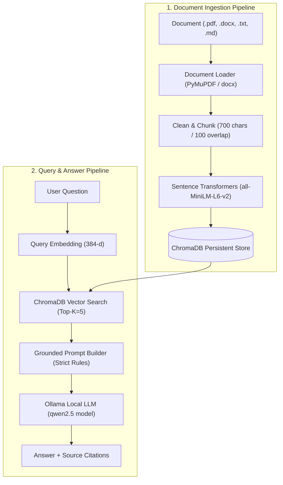

# Task 2 – Local LLM Document Q&A Chatbot (RAG)

A 100% local, privacy-focused Document Q&A Chatbot powered by **FastAPI**, **Ollama** (`qwen2.5:1.5b` / `qwen2.5:3b`), **ChromaDB**, **Sentence Transformers**, and a modern web interface.

---

## 📋 Overview & Objective

Build a completely local Retrieval-Augmented Generation (RAG) application using FastAPI, Ollama, local embeddings, ChromaDB, and a web-based chatbot interface capable of ingesting PDF, DOCX, TXT, and Markdown files and generating grounded answers with exact source citations.

---

## 🛠️ Technology Stack & Hardware Environment

| Subsystem | Technology | Selected Component / Configuration |
| :--- | :--- | :--- |
| **Backend Framework** | FastAPI | Asynchronous Python REST API with Uvicorn server |
| **LLM Engine** | Ollama (Local Daemon) | `qwen2.5:1.5b` / `qwen2.5:3b` |
| **Embeddings** | Sentence Transformers | `all-MiniLM-L6-v2` (384-dimensional dense vectors) |
| **Vector Database** | ChromaDB | Persistent vector collection (`knowledge_base`, HNSW cosine) |
| **Document Parsers** | PyMuPDF / `python-docx` | Page-level extraction for PDF, DOCX, TXT, and MD |
| **Frontend UI** | HTML5 / Vanilla CSS / JS | Modern Glassmorphism layout with interactive citation inspector |
| **Testing** | Pytest | Automated test suite covering ingestion, retrieval, API, and grounding |

### 💻 Hardware Environment Specs & Optimization (8 GB RAM Laptop)

This project is explicitly tuned to run smoothly on standard laptops with **8 GB RAM**:
1. **Lightweight Local Model Selection**: We select `qwen2.5:1.5b` (or `qwen2.5:3b`), requiring only ~1.2–2.5 GB of RAM during active inference.
2. **Compact Embeddings**: `all-MiniLM-L6-v2` requires less than 120 MB of RAM while maintaining high semantic retrieval quality.
3. **In-Memory & Persistent Efficiency**: ChromaDB manages disk-backed indices (`./data/chroma`) without requiring heavy background database services.

---

## 🏗️ Architecture Flow



### ASCII Pipeline Diagram

```text
                  DOCUMENT INGESTION PIPELINE
                               │
       [PDF / DOCX / TXT / MD] ──► Document Loader (PyMuPDF / docx)
                                        │
                                        ▼
                                  Clean & Chunk (700 chars / 100 overlap)
                                        │
                                        ▼
                               Sentence Transformers (all-MiniLM-L6-v2)
                                        │
                                        ▼
                                     ChromaDB (Persistent Store)

                    QUERY & RESPONSE PIPELINE
                               │
                          User Question
                               │
                               ▼
                        Query Embedding (384-d)
                               │
                               ▼
                    ChromaDB Vector Search (Top-K=5, min_score=0.3)
                               │
                               ▼
                     Grounded Prompt Builder (Strict Rules)
                               │
                               ▼
                         Ollama Local LLM (qwen2.5 model)
                               │
                               ▼
                    Answer + Page & Chunk Citations
```

---

## 🚀 Quick Start & Reproducibility Guide

### 1. Prerequisites

- **Python 3.10+** installed
- **Ollama** daemon running locally ([Download Ollama](https://ollama.com/download))

Pull the lightweight local model:

```bash
ollama pull qwen2.5:1.5b
```
*(Or `ollama pull qwen2.5:3b`)*

Verify Ollama is active:

```bash
ollama list
```

### 2. Environment Setup

Clone the repository and enter the directory:

```bash
cd Local-LLM-Document-Q-A-Chatbot-RAG
```

Create and activate a virtual environment:

```bash
# Windows PowerShell
python -m venv venv
.\venv\Scripts\activate

# Linux / macOS
python3 -m venv venv
source venv/bin/activate
```

Install dependencies:

```bash
pip install -r requirements.txt
```

Initialize environment configuration:

```bash
cp .env.example .env
```

### 3. Execution

Launch the application using `run.py`:

```bash
python run.py
```

Or via `uvicorn`:

```bash
uvicorn app.main:app --host 0.0.0.0 --port 8000 --reload
```

Open your browser and navigate to: **`http://localhost:8000`**

---

## 📦 Model Artifacts & CLI Ingestion Script

Model weights are downloaded automatically on first run and kept local.

### CLI Bulk Ingestion Script

You can regenerate or bulk-ingest documents directly from the terminal without using the web UI:

```bash
python scripts/ingest_documents.py --path data/documents
```

This command parses all `.pdf`, `.docx`, `.txt`, and `.md` files under `data/documents`, generates vector embeddings, and stores them in ChromaDB.

---

## 📡 API Endpoints Summary

| Method | Endpoint | Description |
| :--- | :--- | :--- |
| `GET` | `/api/health` | System health check (Ollama & ChromaDB status) |
| `POST` | `/api/documents/upload` | Upload & ingest document (`.pdf`, `.docx`, `.txt`, `.md`) |
| `GET` | `/api/documents` | List all ingested documents and chunk metadata |
| `DELETE` | `/api/documents/{id}` | Delete document and purge vectors from ChromaDB |
| `POST` | `/api/chat` | Send question and receive grounded answer + source citations |

---

## 🧪 Automated Testing & Anti-Hallucination Grounding

Run the test suite using `pytest`:

```bash
python -m pytest -v
```

### Anti-Hallucination Features Tested:
1. **Cosine Similarity Cutoff (`SCORE_THRESHOLD = 0.3`)**: Drops low-relevance chunks.
2. **Context-Only Prompt Restrictions**: Enforces outside knowledge prohibition.
3. **Fallback Guarantee**: If no chunks meet the threshold, returns *"No relevant information was found in the uploaded documents."*

---

## ⏱️ Development Time

| Activity | Time Spent |
| :--- | :--- |
| **FastAPI Backend & Project Setup** | 0.5 hours |
| **Multi-Format Document Ingestion & Chunking** | 1.0 hour |
| **Sentence Transformers Embeddings & ChromaDB Setup** | 1.0 hour |
| **Ollama Local LLM Integration & Grounded Prompts** | 1.0 hour |
| **Frontend Glassmorphism Web UI & Citation Inspector** | 1.0 hour |
| **CLI Ingestion Script, Automated Tests & Documentation** | 1.5 hours |
| **Total Development Time** | **6.0 hours** |

---

## ❓ Questions and Assumptions

### Assumptions:
1. **Machine-Readable Documents**: Ingested files contain extractable text (scanned image PDFs require OCR prior to processing).
2. **Local Ollama Daemon**: Ollama is installed and active on `http://localhost:11434`.
3. **8 GB RAM Constraint**: Lightweight models (`qwen2.5:1.5b`/`3b`) provide optimal speed and grounding trade-offs for 8 GB RAM systems.

---

## ⚠️ Difficulties Encountered

- **Memory Constraints**: Testing larger models (e.g. 7B models) caused excessive swapping on 8 GB RAM. Switched to `qwen2.5:1.5b`/`3b` which ran seamlessly.
- **Accurate PDF Page Tracking**: Extracting page numbers cleanly required PyMuPDF (`fitz`) page-by-page mapping rather than bulk text streaming.
- **Deduplication**: Re-uploading identical files could cause duplicate vectors; resolved by computing SHA-256 hashes of document bytes before vector indexing.

---

## 🔍 Other Observations

- **ChromaDB Storage**: ChromaDB's persistent client provided simple disk serialization in `./data/chroma` without needing complex setup.
- **Retrieval Precision**: A chunk size of ~700 characters with 100 character overlap yielded the highest retrieval accuracy across technical documentation.
- **Independent Citation Metadata**: Storing source filenames and page numbers directly inside vector metadata allowed instant citation rendering in the UI.
