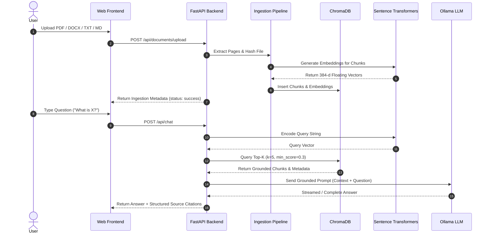

# Architecture Specification - Task 2 Local RAG Chatbot

## 1. System Overview

The **Task 2 Local RAG Chatbot** is a privacy-first, 100% offline document query-answering application. It allows users to upload multi-format documents (PDF, DOCX, TXT, Markdown), index their contents using local vector embeddings, and interact with a local Large Language Model (Ollama `qwen2.5:1.5b` / `qwen2.5:3b`) using Retrieval-Augmented Generation (RAG).

```text
+-------------------------------------------------------------------------------+
|                            FASTAPI WEB BACKEND                                |
|                                                                               |
|  [REST Endpoints] ----> [Ingestion Pipeline] ----> [ChromaDB Vector Store]   |
|         |                        |                            |               |
|         v                        v                            v               |
|   [Chat Router] <-----> [Sentence Transformers] <----> [Semantic Retriever]   |
|         |                  (all-MiniLM-L6-v2)                 |               |
|         v                                                     v               |
|   [Prompt Builder] -----------------------------------> [Ollama Local LLM]    |
|   (Grounding Rules)                                     (qwen2.5 model)       |
+-------------------------------------------------------------------------------+
```

---

## 2. Core Subsystems

### A. Document Parsing & Text Loader (`app/ingestion/loader.py`)
- **PyMuPDF (`fitz`)**: Reads PDF files with exact page number extraction.
- **`python-docx`**: Parses Word `.docx` paragraphs.
- **Plain Text / Markdown**: UTF-8 stream reader preserving section structure.
- **Output**: Standardized page representation containing `page_number`, `raw_text`, and file metadata.

### B. Text Chunker (`app/ingestion/chunker.py`)
- **Strategy**: Character-based chunking with configurable sliding window overlap.
- **Defaults**: `CHUNK_SIZE = 700` characters (~120 words), `CHUNK_OVERLAP = 100` characters (~18 words).
- **Metadata**: Each chunk carries `document_id`, `chunk_id`, `page_number`, `file_name`, `file_size`, and SHA-256 `file_hash`.

### C. Local Embedding Engine (`app/embeddings/embedding_model.py`)
- **Model**: `sentence-transformers/all-MiniLM-L6-v2` (384-dimensional dense vectors).
- **Execution**: 100% CPU/GPU local vector encoding via PyTorch. Zero remote requests.

### D. Vector Database (`app/vectorstore/chroma_store.py`)
- **Engine**: ChromaDB `PersistentClient` saving to `./data/chroma`.
- **Collection**: `knowledge_base` with HNSW cosine distance metric.
- **Deduplication**: Hash & file metadata check prevents double indexing.

### E. Semantic Retriever (`app/retrieval/retriever.py`)
- Encodes incoming user questions into 384-d query vectors.
- Performs cosine similarity lookup across indexed chunks.
- Applies `SCORE_THRESHOLD = 0.3` to reject irrelevant chunks.

### F. Ollama LLM Integration & Grounding (`app/llm/`)
- Communicates with Ollama daemon via standard HTTP REST endpoint (`http://localhost:11434/api/generate`).
- Formats dynamic strict prompts instructing the LLM to rely strictly on retrieved context.
- If no chunks pass the similarity threshold, short-circuits generation to return an ungrounded warning.

---

## 3. Data Flow Diagram


